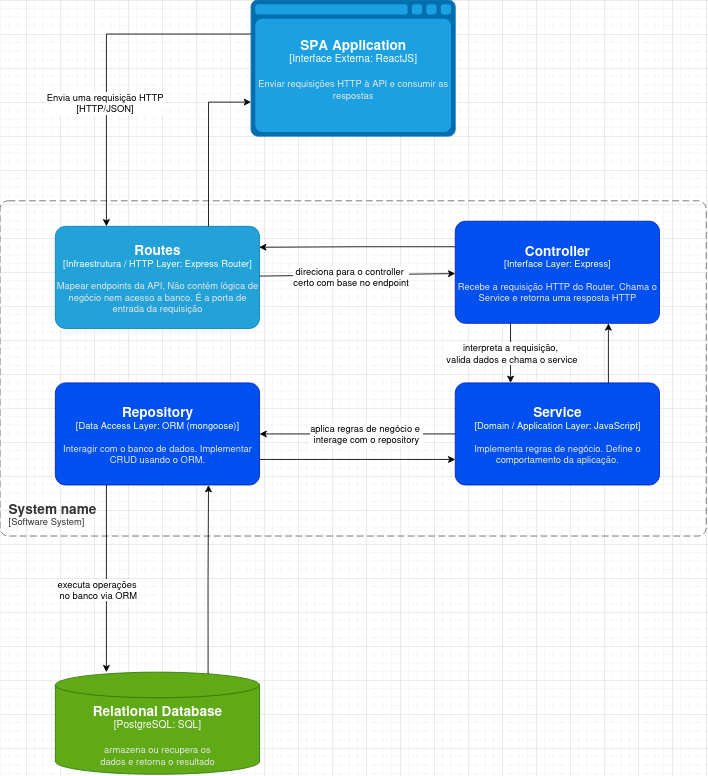

# 🧱 FullLayer API

Uma API RESTful desenvolvida com Node.js e Express, responsável pela autenticação de usuários e operações de CRUD de produtos. Este serviço faz parte do FullLayerJS, um sistema full-stack totalmente conteinerizado com Docker.

## 🚀 Tecnologias Utilizadas

- Node.js
- Express.js
- PostgreSQL
- Sequelize ORM
- JWT com HttpOnly Cookies
- Docker & Docker Compose
- Helmet + CORS

---

## 🧩 Arquitetura do Projeto

A API foi construída seguindo uma arquitetura em 3 camadas, garantindo organização, manutenção simples e baixo acoplamento:

- Routes → Roteamento da API
- Controllers → Recebem requisições e enviam respostas
- Services → Regras de negócio
- Repositories → Acesso ao banco

<div align="center">
  
  

</div>

### Data Flow

<div align="center">
  
</div>

---

## Como rodar o projeto

1. Clonar o repositório

```bash
git clone https://github.com/beeleza/full-layer-api
cd full-layer-api
```

2. Instalar dependências

```bash
npm install
```

3. Subir banco de dados com docker

```bash
docker compose up -d --build
```

4. Iniciar o servidor

```bash
npm run dev
```

## Variáveis de ambiente

```env
NODE_ENV=development

PORT=3000
FRONTEND_URL=http://localhost:5173
JWT_SECRET=

# CONFIGURAÇÕES DE CONEXÃO COM POSTGRESQL
POSTGRES_DB=database_development
POSTGRES_USER=root
POSTGRES_PASSWORD=root
PGADMIN_EMAIL=admin@admin.com
PGADMIN_PASSWORD=admin
DB_HOST=127.0.0.1
```

## 📌 Endpoints

### 🔑 Autenticação

**POST** `/api/v1/auth/register`

Cria um novo usuário no sistema.

```json
{
  "name": "string",
  "email": "string",
  "password": "string",
  "imageUrl": "string"
}
```

**Resposta**:

```json
{
  "message": "User created successfully",
  "user": {
    "id": "number",
    "username": "string",
    "email": "string"
  }
}
```

**POST** `/api/v1/auth/login`

Realiza o login do usuário, valida credenciais e retorna um JWT salvo em cookie HTTP-only.

```json
{
  "email": "string",
  "password": "string"
}
```

**Resposta**:

```json
{
  "message": "Login successful",
  "user": {
    "id": 1,
    "username": "string",
    "email": "string"
  }
}
```

**GET** `/api/v1/auth/logout`

Realiza logout limpando o cookie JWT.

**Resposta**:

```json
{
  "message": "Logout successful"
}
```

### 📂 Categorias

Endpoints responsáveis pelo CRUD de categorias.
Todas as rotas abaixo exigem **usuário autenticado**.

**POST** `/api/v1/category`

Cria uma nova categoria vinculada ao usuário autenticado.

```json
{
  "name": "string",
  "colorHex": "string"
}
```

**Resposta**:

```json
{
  "id": "number",
  "name": "string",
  "userId": "number",
  "createdAt": "2025-01-01T00:00:00.000Z",
  "updatedAt": "2025-01-01T00:00:00.000Z"
}
```

**GET** `/api/v1/category?page=1&limit=10`

Lista categorias com paginação, retornando os dados no formato abaixo.

### **Query Params**

| Param | Tipo   | Default | Descrição                      |
| ----- | ------ | ------- | ------------------------------ |
| page  | number | 1       | Número da página               |
| limit | number | 10      | Quantidade de itens por página |

**Resposta**:

```json
{
  "data": [
    {
      "id": "number",
      "name": "string",
      "colorHex": "string",
      "createdAt": "2025-01-01T00:00:00.000Z",
      "updatedAt": "2025-01-01T00:00:00.000Z",
      "userId": "number"
    }
  ],
  "pagination": {
    "currentPage": 1,
    "totalPages": 1,
    "totalItems": 1,
    "itemsPerPage": 10,
    "hasNext": false,
    "hasPrev": false
  }
}
```

**GET** `/api/v1/category/:id`

Retorna uma categoria pelo ID.

**Reposta**:

```json
{
  "id": "number",
  "name": "string",
  "colorHex": "string",
  "createdAt": "2025-01-01T00:00:00.000Z",
  "updatedAt": "2025-01-01T00:00:00.000Z",
  "userId": "number"
}
```

**PUT** `/api/v1/category/:id`

Atualiza uma categoria pelo ID.

```json
{
  "name": "string",
  "colorHex": "string"
}
```

**Resposta**:

```json
{
  "id": "number",
  "name": "string",
  "colorHex": "string",
  "createdAt": "2025-01-01T00:00:00.000Z",
  "updatedAt": "2025-01-01T00:00:00.000Z",
  "userId": 4
}
```

**DELETE** `/api/v1/category/:id`

Exclui uma categoria pelo ID.

**Resposta**:

```json
{
  "message": "Category deleted successfully"
}
```

## 🛒 Produtos

Endpoints responsáveis pelo CRUD de produtos. Assim como as categorias, todas as rotas exigem **usuário autenticado**.

**POST** `/api/v1/product`

Cria um novo produto associado ao usuário autenticado.

```json
{
  "name": "string",
  "price": "number",
  "description": "string",
  "categoryId": "number" // id de uma categoria existente
}
```

**Reposta**:

```json
{
  "price": "number",
  "id": "number",
  "name": "string",
  "description": "string",
  "categoryId": "number",
  "createdAt": "2025-01-01T00:00:00.000Z",
  "updatedAt": "2025-01-01T00:00:00.000Z",
  "userId": "number"
}
```

**GET** `/api/v1/product?page=1&limit=10`

Lista produtos com paginação.

### **Query Params**

| Param | Tipo   | Default | Descrição                      |
| ----- | ------ | ------- | ------------------------------ |
| page  | number | 1       | Número da página               |
| limit | number | 10      | Quantidade de itens por página |

**Resposta**:

```json
{
  "data": [
    {
      "price": "number",
      "id": "number",
      "name": "string",
      "description": "string",
      "createdAt": "2025-01-01T00:00:00.000Z",
      "updatedAt": "2025-01-01T00:00:00.000Z",
      "categoryId": "number",
      "userId": "number"
    }
  ],
  "pagination": {
    "currentPage": 1,
    "totalPages": 1,
    "totalItems": 1,
    "itemsPerPage": 10,
    "hasNext": false,
    "hasPrev": false
  }
}
```

**GET** `/api/v1/product/:id`

Retorna um produto pelo ID

```json
{
  "price": "number",
  "id": "number",
  "name": "string",
  "description": "string",
  "createdAt": "2025-01-01T00:00:00.000Z",
  "updatedAt": "2025-01-01T00:00:00.000Z",
  "categoryId": "number",
  "userId": "number"
}
```

**PATCH** `/api/v1/product/:id`

Atualiza parcialmente um produto.

```json
{
  "name": "string",
  "price": "string",
  "description": "string",
  "categoryId": "number",
  "createdAt": "2025-01-01T00:00:00.000Z",
  "updatedAt": "2025-01-01T00:00:00.000Z"
}
```

**Resposta**:

```json
{
  "price": "number",
  "id": "number",
  "name": "string",
  "description": "string",
  "categoryId": "number",
  "createdAt": "2025-01-01T00:00:00.000Z",
  "updatedAt": "2025-01-01T00:00:00.000Z",
  "userId": "number"
}
```

**DELETE** `/api/v1/product/:id`

Deleta um produto pelo ID

**Reposta**:

```json
{
  "message": "Product deleted successfully"
}
```
